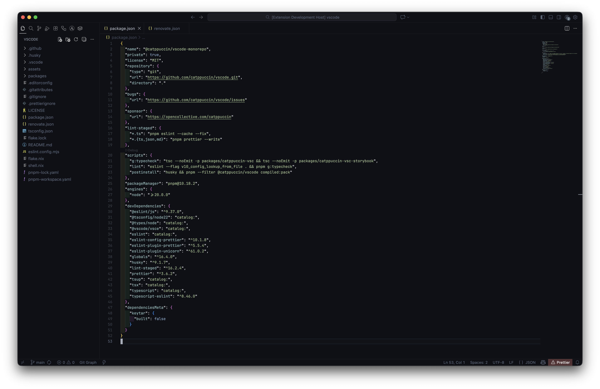
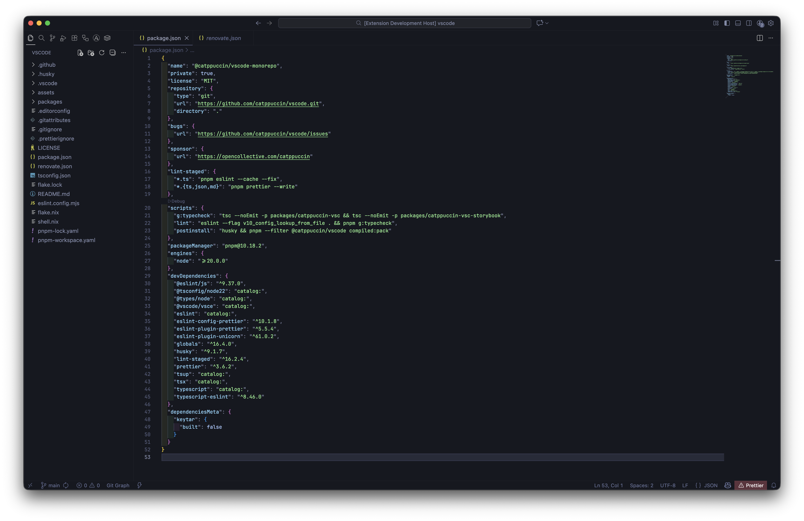
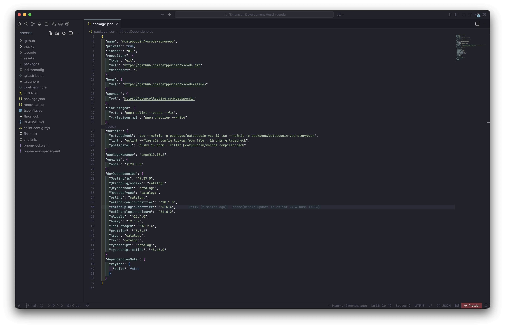

# Voidflare Themes

Voidflare is a small collection of focused dark Visual Studio Code themes tuned for long coding sessions: restrained contrast, calm accents, and legible syntax coloring without glare.

## Available Themes

| Theme | Palette Focus | Quick Character |
|-------|---------------|-----------------|
| Voidflare Obsidian | Ultra-deep background, slate + subtle steel accents | Maximum darkness; minimal eye fatigue in very low‑light |
| Voidflare Abyss | Deep navy-charcoal base, cooler blue highlights, distinct diff/git colors | Slightly higher contrast; crisper UI outlines |
| Voidflare Midnight | Balanced midnight blue inspired by Nordic hues | Softer contrast; gentle cyan/blue syntax pop |

## Install

From the VS Code Marketplace (search "Voidflare") once published, or manually:

1. Clone this repository.
2. In VS Code press: Command+Shift+P → "Preferences: Color Theme".
3. Choose one of: Voidflare Obsidian / Abyss / Midnight.

For local development before publishing: copy or symlink the folder into `~/.vscode/extensions/voidflare-theme` and reload.

## Screenshots

| Voidflare Obsidian | Voidflare Abyss | Voidflare Midnight |
|:------------------:|:---------------:|:------------------:|
|  |  |  |

_Note: Screenshots show a JSON sample in each theme for comparison._

<!-- If adding/changing screenshots, place 1400x900 PNGs in the screenshots/ directory: obsidian.png, abyss.png, midnight.png -->

## Design Notes

- Balanced selection and highlight states: avoids overpowering background glow.
- Muted UI chrome so syntax colors carry emphasis.
- Clear yet not fluorescent ANSI and git decorations.
- Cursor, bracket match, and inlay hints are present but understated.

## Customization

Prefer a tweak? Duplicate a theme JSON under `themes/`, adjust colors, then reload VS Code (Command+Shift+P → Developer: Reload Window).

## Contributing

Issues and pull requests welcome. Keep changes minimal and justify any contrast or accessibility adjustments. Please include before/after screenshots for color changes.
